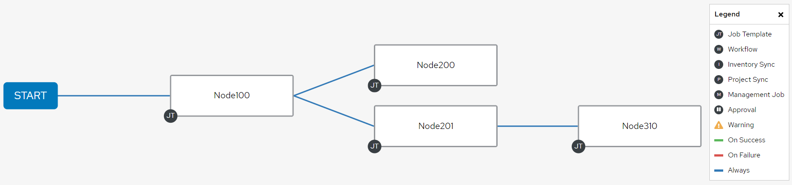

# Introduction

RHAAP Configuration as Code : Projet pour créer "simplement" des JobTemplates/Workflows utilisant le Playbook Générique à partir d'une liste de paramètres.

# Getting Started

[Commande pour exécuter le projet](#build-and-test).

En résumé :
- Les fichiers "*vars/\*_vars_list.yml*" sont les "inputs" utilisateur.
- Les templates vont générer les fichiers de variables principales dans le dossier '*vars/controller_configs*' à partir des inputs utilisateur.
- Le fichier de Voute '*controller_configs/controller_auth.yml*' permet de se connecter au "*Controller RHAAP*".
- Les fichiers de variables principales "*controller_configs/controller_\*.yml*" sont ensuite utilisé dans le playbook pour créer les objets dans *RHAAP*.

## Le dossier '*templates*'

Le dossier '*templates*' contient les fichiers de templates Jinja2 qui permet de générer le fichier des variables principales dans le dossier '*vars/controller_configs*'. Le contenu de ces fichiers montre les variables "*controller_\**" principales que va utiliser la collection "*infra.controller_configuration.dispatch*" pour générer tous les objets.

Les fichiers templates sont les plus important pour générer les bons fichiers de variables. Ajouter s'y les paramètres avec soins. Un exemple avec tous les paramètres sont en commentaire en début de chaque fichier. Pour plus d'informations sur la collection *infra.controller_configuration* qui permet la création des objets RHAAP, [voir le site ici présent](https://galaxy.ansible.com/ui/repo/published/infra/controller_configuration/docs/).

> Erreurs potentiels:  
Le template '*Labels.wml.j2*' pourrait causer des problèmes. Si un nouveau label qui n'existe pas dans RHAAP est ajouter a un des objets, il faut l'ajouter au template '*Labels.wml.j2*' et s'assurer qu'aucune ligne commenter ne bloque leur création.

## Le dossier '*vars*'

Le dossier '*vars*' contient différents fichiers de variables. Selon leur nom, ils ont une fonction différente:

- les fichiers "*vars/\*_vars_list.yml*" sont les "inputs" utilisateur. On défini le nombre d'objets à créer ainsi que leur caractéristiques principales dans un format de variable prédéfini. Il existe un fichier pour les "*JobTemplates*" et un pour les "*Workflows*".

    Il existe 2 fichiers. Un fichier contient les variables (inputs) pour les *JobTemplates* et un autre pour les *Workflows*. La structure reste similaire, mais il y plus de paramètres dans les Workflows.

    Voici des exemples de structure de "*\*_vars_list.yml*" à utiliser :

    - **Variables principales des JobTemplates :**

        S'il est impossible de paramétrer une cédule avec juste une "*rrule*", il est possible de créer plusieurs cédules avec chacune une "*rrule*".

        ```yaml
        jobTemplates_vars:  # Variables principales des JobTemplates
            - name: satelliteHost:CREE_SHARE_LIST
                description: "TOUS LES VENDREDI à 12h00 (AAP)"
                job_vars:
                    target_hosts: satelliteHost.local
                    user_to_execute_task: user
                    script_path: /home/ansible/shares/cree_csv.sh
                    email_recipients: "User@email.com"
                    send_email_on_success: "false"
                    send_email_on_failure: "true"
                schedules:
                    - name: satelliteHost:CREE_SHARE_LIST-schedule
                        description: "TOUS LES VENDREDI à 12h00 (AAP)"
                        starting_hour: '12:00:00'
                        rrules_params:
                            - frequency: 'week'
                                interval: 1
                                byweekday: 'friday'

            - name: satelliteHost:CREE_SHARE_LIST_V2
            # ...
        ```

    - **Variables principales des Workflows :**

        Pour chaque "*job_vars*" dans les "*node_vars*", si une des variables n'est pas présente, les valeurs du "*work_vars*" seront utiliser comme valeur par défaut. Donc les variables doivent être présentes dans "*work_vars*" s'ils sont absentes dans les "*job_vars*" des "*node_vars*".

        Également, chaque Nodes des "*node_vars*" peut être linker à d'autres Nodes par leur nom.

        S'il est impossible de paramétrer une cédule avec juste une "*rrule*", il est possible de créer plusieurs cédules avec chacune une "*rrule*".

        ```yaml
        workflows_vars:  # Variables principales des Workflows
            - name: host2119:taskQaction
                description: "TOUS LES JOURS aux 30 minutes de 6h00 à 23h59 (AAP)"
                work_vars:
                    target_hosts: host2119     # Obligatoire
                    user_to_execute_task: user   # Facultatif
                    script_path: /home/folders/script/groupetasknv taskqaction1r   # Facultatif
                    email_recipients: ""   # Facultatif
                    send_email_on_success: "false"   # Facultatif
                    send_email_on_failure: "true"   # Facultatif
                node_vars:
                    - name: Node100
                        job_vars:
                            # target_hosts: host2119   # Si absent, les valeurs de 'work_vars/target_hosts' seront utilisé.
                            # user_to_execute_task: user   # Si absent, les valeurs de 'work_vars/user_to_execute_task' seront utilisé.
                            script_path: /home/folders/script/groupetasknv taskqaction1r   # Si absent, les valeurs de 'work_vars/script_path' seront utilisé.
                            # email_recipients: ""   # Si absent, les valeurs de 'work_vars/target_hosts' seront utilisé.
                            # send_email_on_success: "false"   # Si absent, les valeurs de 'work_vars/send_email_on_success' seront utilisé.
                            # send_email_on_failure: "true"   # Si absent, les valeurs de 'work_vars/send_email_on_failure' seront utilisé.
                        success_nodes: []
                        failure_nodes: []
                        always_nodes:
                            - Node200
                            - Node201
                    - name: Node200
                        job_vars:
                            script_path: /home/folders/script/groupeat taskaction2c
                        success_nodes: []
                        failure_nodes: []
                        always_nodes: []
                    - name: Node201
                        job_vars:
                            script_path: /home/folders/script/groupetasknv taskqaction2r
                        success_nodes: []
                        failure_nodes: []
                        always_nodes:
                            - Node310
                    - name: Node310
                        job_vars:
                            script_path: /home/folders/script/groupetasknv taskqaction1r
                        success_nodes: []
                        failure_nodes: []
                        always_nodes: []
                schedules:
                    - name: host2119:taskQaction-scheduled
                        description: "TOUS LES JOURS aux 30 minutes de 6h00 à 23h59 (AAP)"
                        starting_hour: "06:00:00"
                        rrules_params:
                            - frequency: 'day'
                                interval: 1
                                byminute: '0, 30'
                                byhour: '6, 7, 8, 9, 10, 11, 12, 13, 14, 15, 16, 17, 18, 18, 20, 21, 22, 23'

            - name: host2119:taskQaction_V2
            # ...
        ```
        
        Voici une représentation graphique des Nodes présenté dans l'exemple ci-haut.
        

- créer les fichiers de variables principales "*controller_configs/controller_\*.yml*" à partir des variables "*controller_\**" provenant des templates Jinja2.

    Il existe 2 fichiers. Un fichier contient les variables pour les *JobTemplates* et un autre pour les *Workflows*.
    
    Voici les noms de variables utilisé :

    ```yaml
    controller_labels:  # Nom de la variable parent.
        - name: "Exemple_label_1"
        # ...

    controller_templates:  # Nom de la variable parent.
        - name: "Exemple_jobTemplate_1"
        # ...

    controller_workflows:  # Nom de la variable parent.
        - name: "Exemple_workflow_1"
        # ...

    controller_schedules:  # Nom de la variable parent.
        - name: "Exemple_schedule_1"
        # ...
    ```

- se connecter à RHAAP avec '*controller_auth.yml*'.

    *Voir section [Voute](#voute-credentialsyml) pour plus d'information.*

## Voute '*credentials.yml*'

Veuiller vérifier si les 'credentials' sont encore valide pour se connecter au Controller de RHAAP. Voici les variables présent dans la voute.

```yaml
controller_hostname: controllerHost.local
controller_validate_certs: false
controller_username: API-AutomatedUser #ou 'admin'
controller_password: ChangeMe
```

## Le dossier '*tests*'

Le dossier '*tests*' contient la même structure de dossier que le projet principale. La différence, c'est qu'il utilise la même Voute et Templates que le projet principale, mais va utiliser ses propre inputs utilisateur et fichiers de variables principales. Avec le playbook test "*test_CreateWorflowsFromTheGenericJob.yml*", on peut tester la création à moindre échelle sans risquer d'écraser les objets pré-existant dans RHAAP (À moins d'utiliser le même préfixe et nom...).

Il est surtout utile pour valider rapidement des "*Schedules*" généré par des "*rrules*" sans "looper" à travers une liste de 142 JobTemplates. C'est vraiment plus rapide.

## Le dossier '*datas_brute*'

Le dossier '*datas_brute*' contient le fichier de variables brute provenant de Commvault. Il sert à générer le fichier de variables '*workflows_vars_list.yml*'. **Il n'est plus nécessaire de l'utiliser présentement.** Plusieurs erreurs ont été corrigé depuis.

Commande AWK :

```bash
cd datas_brute

# Le fichier généré ne contiendra pas les données 'rrules_params' et 'starting_hour'. 
awk -f JobTemplates.awk Commvault_Jobs.txt  > JobTemplatesVars.yml

# La commande suivante peut supprimer le fichier contenant les variables 'rrules_params' qui ont déjà été défini. Écraser le fichier '/vars/jobTemplates_vars_list.yml' existant peut causer la perte de ces variables... Il vous faudra tout recommencer la génération manuel des rrules.
cp JobTemplatesVars.yml ../vars/jobTemplates_vars_list.yml
```

# Build and Test

## Executer pour "Test"

Définir les fichiers "*test_\*_vars_list.yml*" et les fichier templates "*\*.yml.j2*".

Ensuite utiliser la commande suivante pour créer les JobTemplates et Workflows en **test**:

```bash
cd CaC_CreateWorflowsFromTheGenericJob/
cd tests/
ansible-playbook test_CreateWorflowsFromTheGenericJob.yml --ask-vault-pass
```

## Executer pour "Production"

Définir les fichiers "*\*_vars_list.yml*" et les fichier templates "*\*.yml.j2*".

Ensuite utiliser la commande suivante pour créer les JobTemplates et Workflows en **production**:

```bash
cd CaC_CreateWorflowsFromTheGenericJob/
ansible-playbook CreateWorflowsFromTheGenericJob.yml --ask-vault-pass
```
